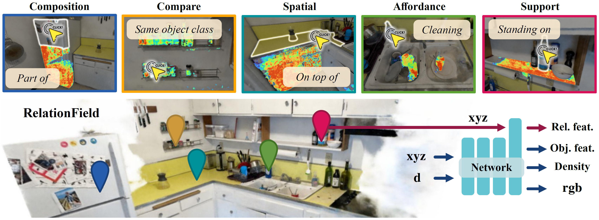

# RelationField 👆
## Relate Anything in Radiance Field 

<a href="https://kochsebastian.com">Sebastian Koch</a>1,2, &nbsp;&nbsp;&nbsp; <a href="https://scholar.google.com/citations?user=dfjN3YAAAAAJ">Johanna Wald</a>3,
&nbsp;&nbsp;&nbsp; <a href="https://scholar.google.com/citations?user=k4m1c6EAAAAJ">Mirco Colosi</a>2,&nbsp;&nbsp;&nbsp;<a href="https://scholar.google.com/citations?user=U3KSTwkAAAAJ">Narunas Vaskevicius</a>2,
 
&nbsp;&nbsp;&nbsp;<a href="https://phermosilla.github.io">Pedro Hermosilla</a>4,&nbsp;&nbsp;&nbsp;<a href="https://federicotombari.github.io/">Federico Tombari</a>3,5,&nbsp;&nbsp;&nbsp;<a href="https://scholar.google.com/citations?user=FuY-lbcAAAAJ">Timo Ropinski</a>1

1Ulm University&nbsp;&nbsp;&nbsp;&nbsp;2Bosch Center for AI&nbsp;&nbsp;&nbsp;&nbsp;3Google&nbsp;&nbsp;&nbsp;&nbsp;4TU Vienna&nbsp;&nbsp;&nbsp;&nbsp;5TU Munich

<h2 class="title is-3">BibTeX</h2>
          <pre><code>
  @article{koch2024relationfield,
    title={RelationField: Relate Anything in Radiance Fields},
    author={Koch, Sebastian and Wald, Johanna and Colosi, Mirco and Vaskevicius, Narunas and Hermosilla, Pedro and Tombari, Federico and Ropinski, Timo},
    journal={arXiv preprint arXiv:2412.13652},
    year={2024}
  }
  </code></pre>
    

  

